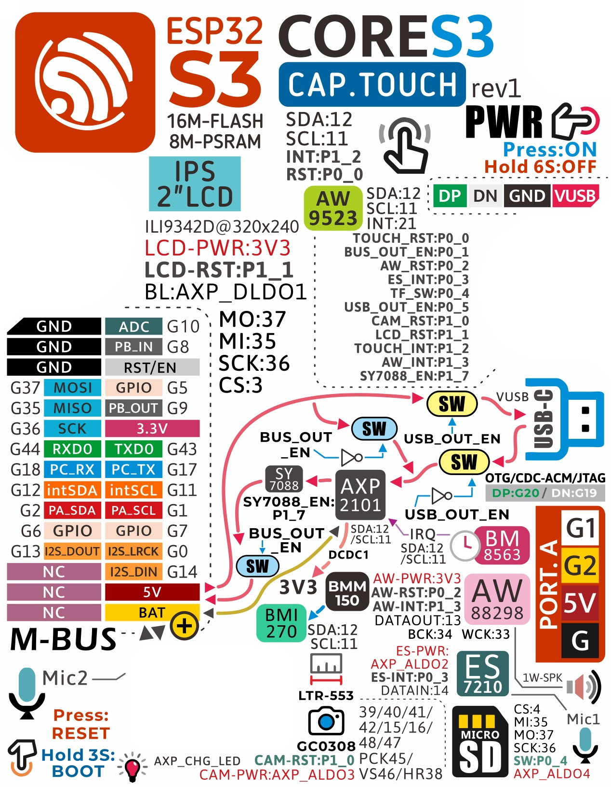
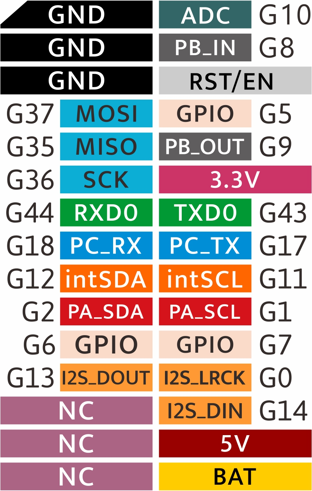

# M5Stack Core S3 — Hardware Reference

**Reference guide · Companion to the Lab 2 flashing handout**

This document collects everything on the physical board itself: the pin header, the
silkscreened component map, and the internal architecture as shown in M5Stack's published
schematic (`Sch_M5_CoreS3_v1_0.pdf`). Use it alongside the Lab 2 handout when you need to know
*what a signal is actually connected to* rather than just how to flash the device.

---

## 1. Overview

| Item | Detail |
|---|---|
| Core | ESP32‑S3, dual‑core Xtensa LX7, Wi‑Fi + Bluetooth LE |
| Flash | 16 MB (GD25Q128 / W25Q128, SPI NOR) |
| Extra RAM | 8 MB PSRAM (ESPSRAM, QSPI) |
| Display | 2.0" IPS LCD, ILI9342D controller, 320×240, SPI |
| Touch | Capacitive touch panel (`CTP1` connector, I²C) |
| Camera | GC0308 |
| Audio in | Dual analog MEMS microphones → ES7210 4‑channel ADC/codec |
| Audio out | AW88298 Class‑D speaker amplifier, 1 W speaker |
| Motion | BMI270 6‑axis IMU (accel + gyro) |
| Magnetic field | BMM150 3‑axis magnetometer |
| Light / proximity | LTR‑553 |
| Real‑time clock | BM8563 (battery‑backed) |
| Power management | AXP2101 PMIC |
| I/O expansion | AW9523B I²C GPIO expander |
| Storage | microSD (SPI) |
| Battery | Internal LiPo via `M‑BUS` connector, JST `J5` (2‑pin) |
| Expansion | Grove **Port A** (I²C), `M5.BUS` 30‑pin internal connector, bottom pin header |

This board is a fully-populated "everything included" microcontroller module — every sensor
and peripheral used across the labs in this course (touch, IMU, camera, microphone, speaker,
Wi‑Fi) lives on this single board, wired back to the ESP32‑S3 over a mix of I²C, SPI, and I²S.

---

## 2. Board Silkscreen / Component Map

M5Stack prints a full reference of the board's chips, pin functions, and internal wiring
directly on the underside sticker. It's the fastest way to identify a signal name without
digging through the schematic.

Reading it block by block:

- **Top-left orange block** — ESP32‑S3 with 16 MB flash and 8 MB PSRAM, the main processor.
- **`IPS 2" LCD`** — the ILI9342D display controller at 320×240, `LCD‑PWR:3V3`,
  `LCD‑RST:P1_1` (driven from the AW9523B expander, not the ESP32‑S3 directly),
  backlight (`BL`) driven from the AXP2101's `DLDO1` output.
- **`AW9523B`** block (top-middle-right) — an I²C GPIO expander at `SDA:12 / SCL:11 / INT:21`.
  Because the ESP32‑S3 doesn't have enough free GPIOs for every reset/enable/chip‑select line
  on this board, the expander fans out to: `TOUCH_RST`, `BUS_OUT_EN`, `AW_RST`, `ES_INT`,
  `TF_SW` (SD card detect), `USB_OUT_EN`, `CAM_RST`, `LCD_RST`, `TOUCH_INT`, `AW_INT`, and
  `SY7088_EN` — twelve signals over one I²C device.
- **`MO/MI/SCK/CS`** (37/35/36/3) — the shared SPI bus used by the LCD, touch controller, and
  microSD card.
- **Left‑hand pin table (`GND … NC`)** — the external pin header, covered in full in §3 below.
- **`M‑BUS`** — the bottom 30‑pin card‑edge connector used to dock the Core S3 into base
  modules (e.g. a DIN rail base).
- **Power block (`SW`, `AXP2101`, `SY7088`, `BM8563`)** — the power path: USB‑C → `AXP2101`
  PMIC → a set of switched rails (`SW`) → the rest of the board. `SY7088` is a boost converter
  used when the board needs to source 5 V from battery power (e.g. powering Port A
  accessories when not on USB). `BM8563` is the battery‑backed real‑time clock.
- **`PORT.A`** — the Grove connector (G1/G2/5V/G) — the course's usual I²C expansion port.
- **`AW88298` / `ES7210`** — the speaker amplifier and the microphone codec respectively, each
  their own I²C‑controlled chip, feeding/reading the shared I²S audio bus (`BCK`, `WCK`,
  `DATAOUT`/`DATAIN`).
- **`BMI270` / `BMM150`** — the IMU and magnetometer, both I²C, both fed from `SDA:12 / SCL:11`
  — the same internal I²C bus (`intSDA`/`intSCL`) used by most of the board's internal chips.
- **`LTR‑553`** — the ambient light / proximity sensor, next to the camera.
- **`GC0308`** — the camera sensor, with its own reset (`CAM‑RST:P1_0`) and power
  (`CAM‑PWR:AXP_ALDO3`) lines routed through the AXP2101 and the AW9523B expander.
- **`MICRO SD`** — the microSD slot, on the same shared SPI bus as the LCD and touch panel,
  with its own chip‑select (`CS:4`) and card‑detect switch (`SW:P0_4`) run through the
  expander.
- **Bottom-left icons** — `Mic2`: press‑to‑reset behaviour of the power button (press to
  reset, hold 3 s to enter boot/download mode), with the charge LED (`AXP_CHG_LED`) shown
  alongside.

---

## 3. Pin Header Reference

The 2×15 header along the bottom edge of the board is what the course refers to when a lab
says "Grove" or "expansion pin" — it's the same signal set drawn on the sticker, laid out here
as a clean two‑column table matching the physical header (GND/black on the left in the
photograph, coloured/functional pins on the right):

| Left pin | Function | | Right pin | Function |
|---|---|---|---|---|
| — | GND | | G10 | ADC |
| — | GND | | G8 | PB_IN |
| — | GND | | — | RST / EN |
| G37 | MOSI | | G5 | GPIO |
| G35 | MISO | | G9 | PB_OUT |
| G36 | SCK | | — | 3.3V |
| G44 | RXD0 | | G43 | TXD0 |
| G18 | PC_RX | | G17 | PC_TX |
| G12 | intSDA | | G11 | intSCL |
| G2 | PA_SDA | | G1 | PA_SCL |
| G6 | GPIO | | G7 | GPIO |
| G13 | I2S_DOUT | | G0 | I2S_LRCK |
| — | NC | | G14 | I2S_DIN |
| — | NC | | — | 5V |
| — | NC | | — | BAT |

Notes on how these map to the internal buses documented in the schematic:

- **`MOSI` / `MISO` / `SCK` (G37/G35/G36)** — this is the *external‑facing* SPI bus, wired on
  the header to the same `MO:37 / MI:35 / SCK:36` signals the sticker shows feeding the
  display, touch panel, and microSD internally. It is the same physical SPI bus, just also
  exposed on the header.
- **`intSDA` / `intSCL` (G12/G11)** — labelled `PA_SDA`/`PA_SCL` isn't shown on this specific
  header row; instead `G12`/`G11` here correspond to the **internal** I²C bus (`SDA:12`,
  `SCL:11`) that the AXP2101, AW9523B, BMI270, BMM150, ES7210, and AW88298 all share
  internally. Grove **Port A** (`PA_SDA`/`PA_SCL`, `G2`/`G1`) is a **separate, external** I²C
  bus — keep the two apart when wiring your own I²C sensors to Port A in later labs; you are
  not sharing a bus with the board's internal chips.
- **`PC_RX` / `PC_TX` (G18/G17)** — a second UART, distinct from `RXD0`/`TXD0` (G44/G43).
- **`I2S_DOUT` / `I2S_LRCK` / `I2S_DIN` (G13/G0/G14)** — the I²S audio bus. Note that `G0` is
  shared with the boot‑mode strap pin (used when force‑entering download mode) — see the
  `SY7088_EN:P1_7` / boot‑hold behaviour noted on the sticker.
- **`PB_IN` / `PB_OUT` (G8/G9)** and **`RST/EN`** — general‑purpose control lines exposed
  alongside the two spare `GPIO` pins (G5, G6, G7).
- **`BAT`** — direct access to the battery rail, separate from the regulated `5V` and `3.3V`
  pins.

---

## 4. Power System — AXP2101 PMIC

Everything on the board is powered through a single **AXP2101** power‑management IC
(`I2C ADDR 0x34`), which sits between USB‑C/battery input and every regulated rail on the
board. From the schematic:

| Rail | Feeds |
|---|---|
| `DCDC1` — 3.3 V / 2 A | Core VDD (the ESP32‑S3 itself) |
| `DCDC3` — 3.3 V / 2 A | Peripheral VDD |
| `DCDC4` — 1.8 V / 1.5 A | — |
| `DCDC5` — 3.3 V / 1 A | LCD backlight |
| `RTCLDO1` — 3.3 V / 30 mA | RTC VDD (keeps the BM8563 clock alive) |
| `ALDO1` — 1.8 V / 300 mA | PA (audio amp) DVDD |
| `ALDO2` — 3.3 V / 300 mA | Audio codec VDDP / mic VDDA |
| `ALDO3` — 3.3 V / 300 mA | Codec VDDA/MIC VDDA — and, per the sticker, camera power |
| `ALDO4` — 3.3 V / 300 mA | microSD card VDD |
| `BLDO1` — 2.8 V / 300 mA | Sensor VDDA |
| `BLDO2` — 1.2 V / 300 mA | Sensor VDD |

Two physical buttons wire directly into the AXP2101: `PWR_KEY` (the power button — press to
power on, hold ~6 s to force power off, per the sticker) and a second switch tied to
`PWROK`/reset behaviour. A red charge‑status LED (`LED1`, driven by `AXP_CHG_LED`) is wired
straight off the PMIC.

Downstream of the AXP2101, three small buck/boost regulator ICs (`SY7088`, and the
`ME1502AM5G` / `ME1502CM5G` parts on the Boost/OTG/PMU/USB schematic page) handle switching
5 V power between four possible directions depending on whether the board is being **charged
over USB**, **powering itself from battery**, **boosting battery power out to Port A /
5 V pin**, or **sourcing USB OTG power out the USB‑C port** — this is why the sticker shows
several `SW` (switch) blocks between the USB connector, the battery, and the rest of the
board, each gated by an enable signal (`BUS_OUT_EN`, `USB_OUT_EN`) ultimately controlled
through the AW9523B I/O expander.

---

## 5. Processor — ESP32‑S3

The ESP32‑S3 (schematic designator `U5`) is wired with:

- **16 MB SPI NOR flash** (`U6`, `GD25Q128`/`W25Q128`) and a **secondary SPI PSRAM**
  (`U7`, ESPSRAM, 8 MB) on its own dedicated QSPI‑style bus, separate from the general‑purpose
  SPI bus used for the display/touch/SD card.
- A **40 MHz crystal** (`X1`) for the main clock, and the RTC's own separate crystal on the
  `BM8563` circuit.
- A **u.FL antenna connector** (`J4`) feeding a printed antenna (`ANT1`, `PROANT440`) through
  an LNA matching network — this is the Wi‑Fi/Bluetooth radio front end.
- **USB‑C** wired directly to the ESP32‑S3's native USB pins (`USB_D_P`/`USB_D_N`) — this is
  why no separate USB‑to‑serial chip or driver is required, as the Lab 2 handout notes.
- A boot‑mode circuit (`U2`, comparator `LMV331`, plus `LED2`) that lights an `ESP_BOOT`
  indicator and helps the board detect whether it should enter the ROM bootloader.

---

## 6. Display and Touch

- **LCD** (`LCD1` connector, `M5_LCD_10P`) — driven over the shared SPI bus
  (`SPI_MOSI`/`SPI_SCK`/`SPI_MISO`), with its own chip‑select (`LCD_CS`) and reset
  (`LCD_RST`) lines. Backlight power (`VCC_BL`) comes from the AXP2101's dedicated
  `DCDC5` rail, so backlight brightness is a power‑rail concern, not a GPIO PWM signal, at
  the hardware level.
- **Touch panel** (`CTP1` connector, `M5_TOUCH_8P`) — a purely I²C device on the same internal
  bus as the rest of the board's sensors, with dedicated `TOUCH_INT` and `TOUCH_RST` lines
  (both routed through the AW9523B expander, not the ESP32‑S3 directly).

---

## 7. Camera

The camera connector (`J2`, `AFC34‑S24FIA‑00`, 24‑pin) carries a full 8‑bit parallel camera
data bus (`CAM_D2`–`CAM_D9`), plus `CAM_HREF`, `CAM_VSYNC`, and `CAM_PCLK` sync signals — this
is a parallel-interface camera (the **GC0308** sensor named on the sticker), not an
SPI/I²C‑only module. It has its own 20 MHz crystal (`X2`) for the sensor's pixel clock
(`CAM_MCLK`), and its reset/power‑down lines (`CAM_RST`, `CAM_PWDN`) are, again, routed
through the AW9523B expander and the AXP2101's `ALDO3` rail.

---

## 8. Motion, Magnetic Field, and Ambient Light

- **BMI270** (`U15`) — 6‑axis IMU (accelerometer + gyroscope), I²C address **0x68** with
  `SDO` tied to GND (0x69 if tied to VDDIO instead — the schematic shows pull resistors for
  both options, populated one way on production boards).
- **BMM150** (`U20`) — 3‑axis magnetometer, sharing the same internal I²C bus as the BMI270.
- **LTR‑553** — ambient light and proximity sensor, shown on the sticker alongside the
  camera, also on the internal I²C bus.

> **Note:** an earlier schematic page in the same document also shows an **MPU6886** 6‑axis
> IMU footprint (`U16`, I²C address `0x68`) wired identically to the internal bus. The board
> sticker for this specific rev1 unit lists **BMI270 + BMM150** as the populated parts, so
> treat the MPU6886 page as an alternate/legacy footprint rather than what's actually on your
> board — if `M5.Imu` calls behave unexpectedly, this is worth knowing about, but don't assume
> both chips are present.

---

## 9. Real-Time Clock

**BM8563** (`U4`) — a battery‑backed RTC with its own 32.768 kHz crystal (`Y1`), powered from
`RTC_VDD` (the AXP2101's `RTCLDO1` rail) so it keeps time even when the main board is off, as
long as the internal battery holds charge. It shares the internal I²C bus and raises
`AXP_WAKEUP` to bring the board out of sleep on an RTC alarm.

---

## 10. Audio

- **Microphones** — two analog MEMS microphones (`U12`, `U13`, `MSM381A3729H9BPC`), each
  feeding a differential pair into the codec.
- **ES7210** (`U9`) — a 4‑channel microphone ADC/codec, I²C address **0x40**, converting the
  analog mic signals to the shared I²S bus (`I2S_BCK`/`I2S_WCK`/`I2S_DATI`).
- **AW88298** (`U8`) — a Class‑D speaker amplifier, I²C address **0x36**, taking I²S audio
  output (`I2S_DATO`) and driving the onboard 1 W speaker.

Both audio chips are controlled over I²C (for configuration) *and* carry audio data over a
separate, shared I²S bus — two different buses doing two different jobs, which is worth
keeping straight if a lab ever has you debug "no sound" versus "sound but wrong settings."

---

## 11. Storage — microSD

The microSD slot (`U11`, `MicroSD‑SPI`) shares the same SPI bus as the LCD and touch panel,
with its own chip‑select (`TF_CS`) and a card‑detect switch (`TF_SW`) — both, again, routed
through the AW9523B I/O expander rather than driven directly from the ESP32‑S3.

---

## 12. I²C Address Map

Every internally I²C‑connected chip on the board, gathered in one place. This is the fastest
way to identify which device a bus scan (`i2c.scan()`) result belongs to:

| Address (7‑bit) | Device | Function |
|---|---|---|
| `0x34` | AXP2101 | Power management IC |
| `0x36` | AW88298 | Speaker amplifier |
| `0x40` | ES7210 | Microphone codec / ADC |
| `0x58` | AW9523B | I/O expander (reset/enable/CS fan‑out) |
| `0x68` | BMI270 (`SDO`=GND) — or MPU6886 on the alternate IMU footprint | IMU (accel + gyro) |
| `0x69` | BMI270 (`SDO`=VDDIO) | IMU, alternate address |

The touch controller and the BMM150 magnetometer are also on this internal bus per the
sticker and schematic, but their specific 7‑bit addresses aren't labelled on the pages
provided — if you need them at runtime, `i2c.scan()` from a Run Once test is the reliable way
to confirm what's actually present on your unit, the same technique the Lab 2 handout
recommends for resolving `AttributeError`s against the `M5` library.

---

## 13. Expansion Connectors Summary

| Connector | Type | Carries |
|---|---|---|
| Bottom pin header (2×15) | 0.1" header | GND, external SPI, external UARTs, internal I²C, Grove Port A I²C, I²S, 5V, 3.3V, BAT — full table in §3 |
| `PORT.A` (Grove) | 4‑pin Grove | I²C (`PA_SDA`/`PA_SCL`), 5V, GND — the port used for external sensors in later labs |
| `M5.BUS` | 30‑pin card edge | Full internal bus — SPI, both UARTs, both I²C buses, I²S, boot strap, power rails — used for docking into base modules |
| `M‑BUS` (bottom) | Card‑edge | Physical docking connector for base modules (e.g. DIN rail base) |
| `J5` | JST 2×1.25mm | Direct battery connector |
| `J3` | GH2.0‑4P | Secondary Grove‑style header (`PA_SDA`/`PA_SCL`/`BUS_OUT`) |
| USB‑C | — | Native ESP32‑S3 USB, power in, OTG/CDC‑ACM/JTAG |

---

## 14. Why This Matters for the Course

Every lab from Week 3 onward touches one specific piece of this board — the touch panel in
Lab 3, the IMU in Lab 4, the camera in Lab 5, the microphone in Lab 6, the speaker in Lab 7,
and Wi‑Fi in Lab 8. When something doesn't behave as expected and you're asking Claude for
help, the detail that actually narrows down the problem is usually here: which bus a signal
is on, which chip owns it, and whether it's a signal the ESP32‑S3 drives directly or one
routed through the AW9523B expander. "It's not working" is not diagnosable; "the touch reset
line is on the I/O expander, not a direct GPIO, so I confirmed the expander responds on
`0x58` first" is.
