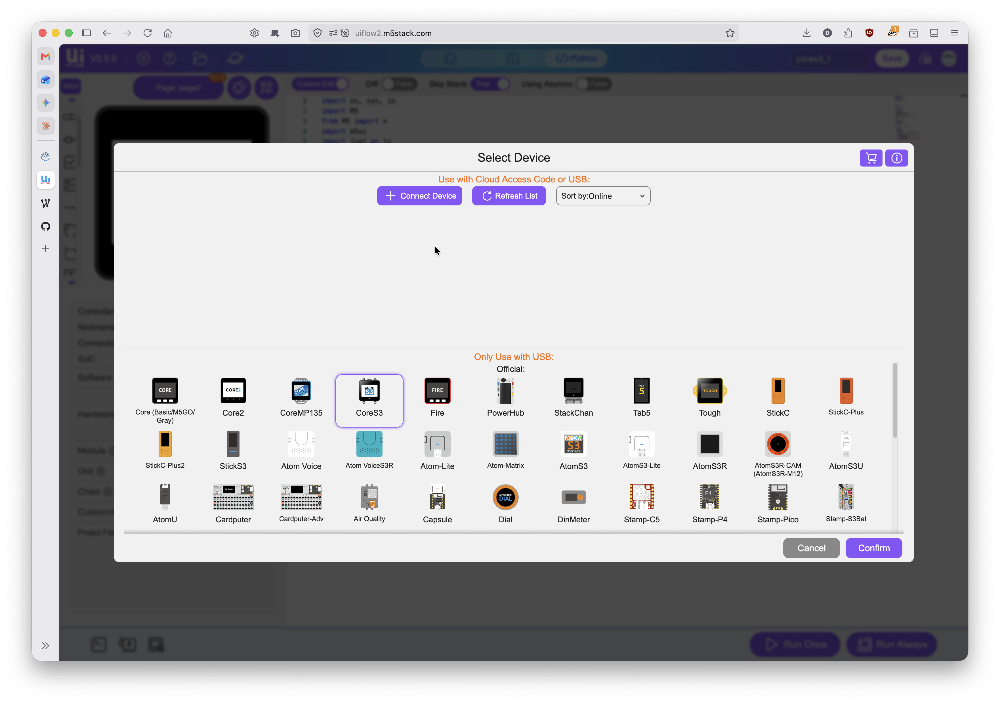
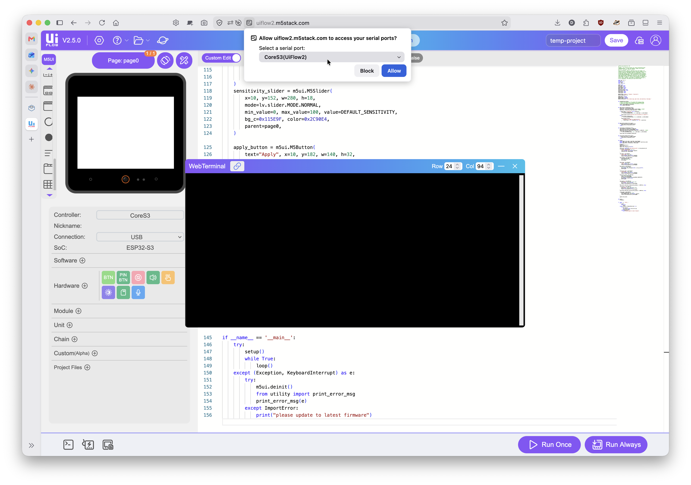
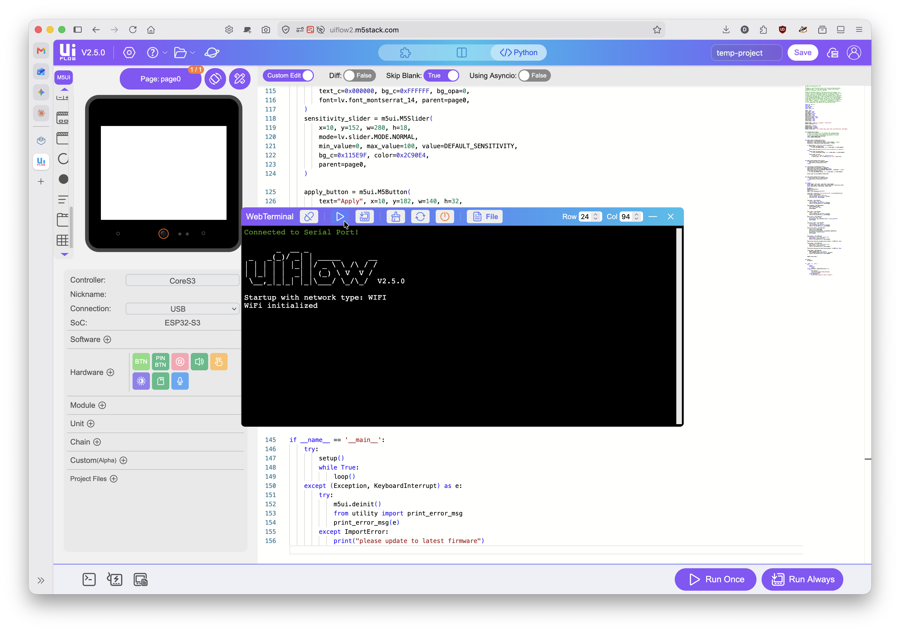
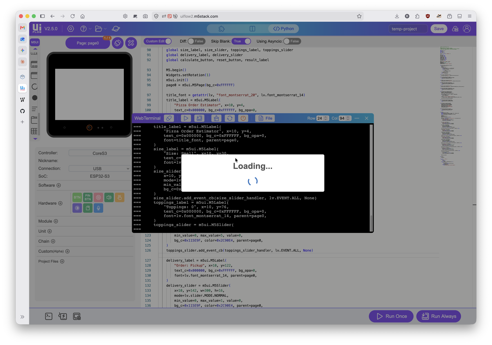

# PRG455 — Uploading and Running Code on the Core S3

**Reference guide · Use this every time you run a program on your device, starting with Lab 3**

Lab 2 got your device flashed and your web editor connected once. This guide covers the part
you'll repeat constantly for the rest of the course: getting a `.py` file you wrote in VS Code
running on the physical Core S3 using the UIFlow2 web editor, and watching it work.

**Prerequisite:** your Core S3 must already be flashed with the course standard firmware, Boot
Option set to "Show startup menu and network setup," per the Lab 2 handout. If your device boots
to a black screen instead of the UIFlow2 startup screen, go fix that first — nothing here will
work until it's right.

---

## Before you start: the cable, again

**Your USB-C cable must support both power and data.** A charge-only cable will power the device
and look completely normal while the web editor never sees it. If Step 2 below doesn't find your
device, this is the first thing to check — not the last.

---

## Step 1 — Open the web editor and pick your device

Go to `uiflow2.m5stack.com` in Chrome, Edge, or Firefox 151+.

Click the **Controller** field (or the device icon, if this is your first time) to open the
device picker. CoreS3 is listed under the **"Only Use with USB"** section — it doesn't support
the cloud Access Code connection method other devices use, only a direct USB link.

Select **CoreS3** and click **Confirm**.

**Reference Image 1** shows this dialog — CoreS3 highlighted in the device grid, with Cancel and
Confirm at the bottom right.



## Step 2 — Set the connection type and connect

In the left-hand panel, confirm two fields:

- **Controller:** `CoreS3`
- **Connection:** `USB`

The Connection field is a dropdown — some devices default to Access Code (cloud) instead, so
don't assume USB is already selected. Set it explicitly.

With the Core S3 plugged in (power-and-data cable, direct to your computer, no hub), click
**Connect Device**. Your browser will show its own permission prompt — this is the browser
itself asking, not the web editor:

> **Allow uiflow2.m5stack.com to access your serial ports?**
> Select a serial port: `CoreS3 (UiFlow2)`

Confirm the correct port is selected and click **Allow**.

**Reference Image 2** shows this exact prompt.



## Step 3 — Confirm the connection in the WebTerminal

Open the **WebTerminal** panel (bottom toolbar, or wherever it's docked in your layout). Once the
connection succeeds, it prints:

```
Connected to Serial Port!
```

followed by the UIFlow boot banner and version number. **This is your confirmation that the link
is live** — if you don't see this, nothing you run afterward will reach the device.

**Reference Image 3** shows a successful connection: the banner, version `V2.5.0`, and Wi-Fi
initialization messages.



## Step 4 — Write or paste your code, then Run Once

Switch the editor to **Python code view** (the `</> Python` toggle near the top, if you're not
already there — this course works in code, not the Blockly block view).

Paste in the `.py` file you wrote in VS Code, or write directly in the editor if you're just
testing something small.

Click **Run Once** (bottom right, the purple button with the play triangle). You'll briefly see a
**Loading...** indicator while your code transfers, and the WebTerminal will echo each line as
it's sent, prefixed with `===`.

**Reference Image 4** shows this in progress — the Loading spinner over a WebTerminal actively
receiving code.



Once the transfer finishes, your program starts running on the device — watch the physical
screen for anything it draws, and the WebTerminal for anything it prints.

---

## ⚠️ Run Once, not Run Always

The button right next to Run Once is **Run Always**, and it behaves very differently: it
overwrites `main.py` on the device and sets your program to run on every future boot, including
after a hard reset. A buggy program set this way can leave the device stuck re-running the same
broken code with no way back except a full re-flash.

**This course uses Run Once exclusively.** If you're not certain which button you're about to
click, stop and look again — they're right next to each other for a reason, and it's not a
friendly one. Full explanation and recovery steps are in the Lab 2 handout, Part 9.

---

## Troubleshooting

| Symptom | Cause and fix |
|---|---|
| CoreS3 doesn't appear connected / nothing happens when you click Connect Device | Charge-only cable, almost always. Try a different cable, then a different port, and remove any hub. |
| No browser permission prompt appears | You may already have an active pairing from a previous session — try Refresh List in the device picker, or reload the page. |
| Browser prompt shows no port, or the wrong one | Unplug the Core S3, note which port disappears from a fresh prompt, replug, and select that one specifically. |
| WebTerminal never shows "Connected to Serial Port!" | Another browser tab or program has the port open — close other web editor tabs and any terminal/serial monitor, then retry. |
| Connection field only offers Access Code, not USB | Confirm you selected **CoreS3** specifically in the device picker — some other device entries may default differently. |
| Run Once seems stuck on "Loading..." | Give it a few seconds for longer programs. If it never resolves, check the WebTerminal for an error, and confirm the device didn't get unplugged mid-transfer. |
| Code runs but nothing appears on screen | Confirm your program actually calls `M5.begin()` and, for M5UI programs, `page0.screen_load()` — a syntactically valid program that never loads a page won't show anything. |
| I clicked Run Always by mistake | See the callout above and Lab 2, Part 9. Don't panic — try a reset first, then M5Burner's Configure option, then a full re-flash if neither works. |

---

## Reference Images

Screenshots of the full connect-and-run workflow, captured directly from a working session.

**Image 1 — Device picker**, CoreS3 selected under "Only Use with USB."


**Image 2 — Browser serial port permission prompt**, shown after clicking Connect Device.


**Image 3 — WebTerminal after a successful connection**, showing the boot banner and version.


**Image 4 — Run Once in progress**, Loading indicator with code transferring into the WebTerminal.


