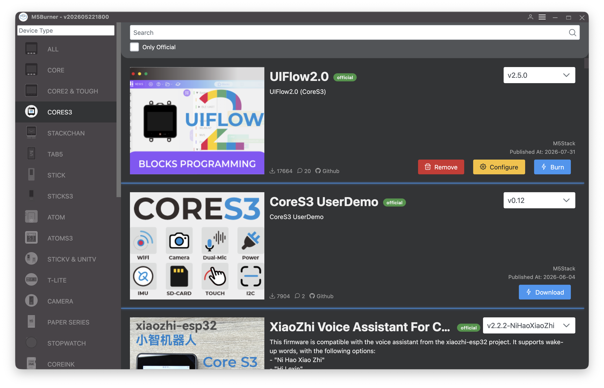
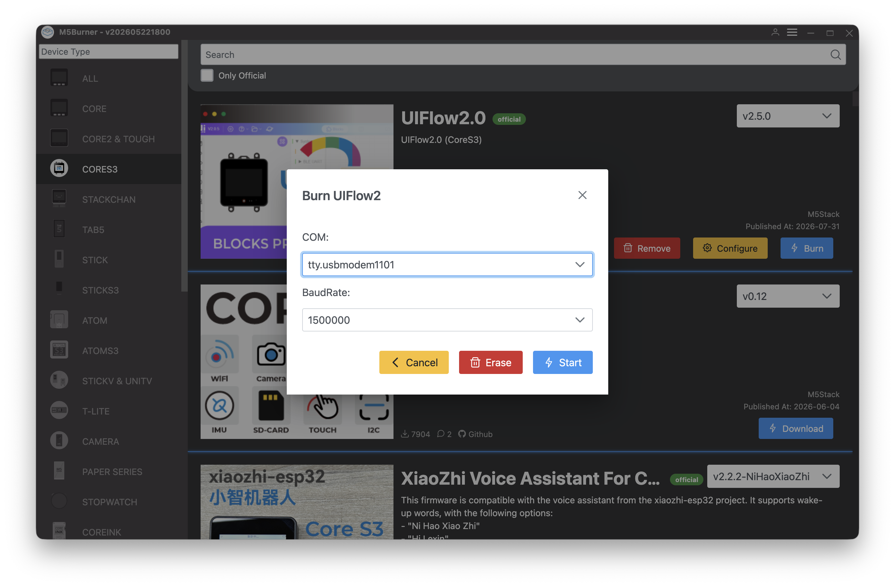
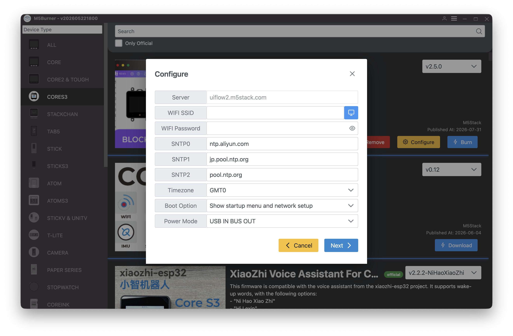
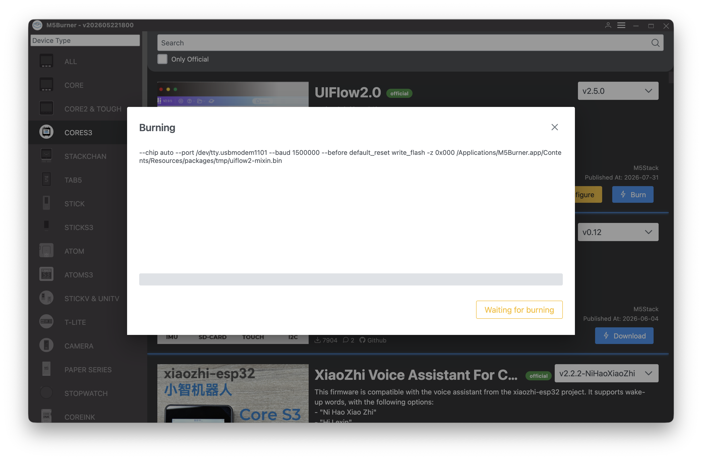
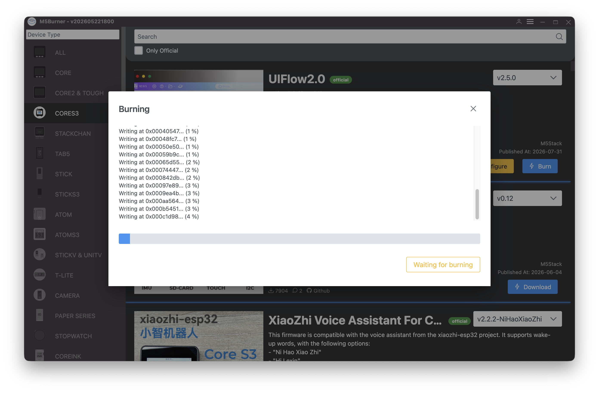
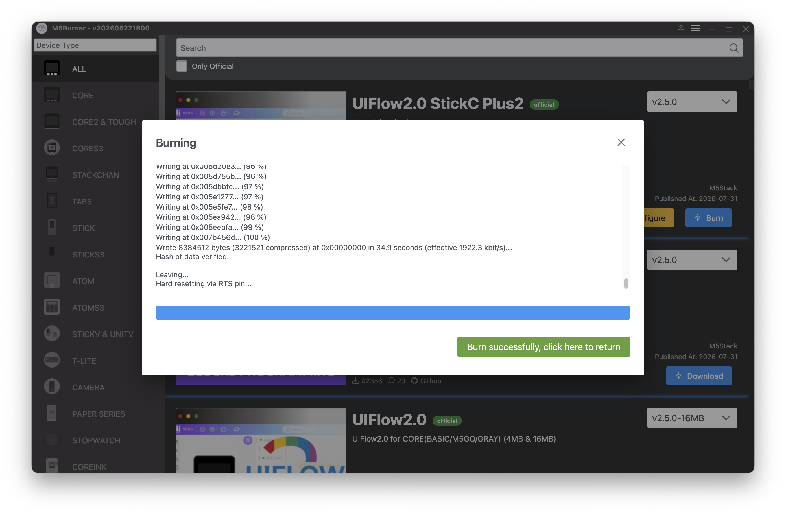

# PRG455 — Lab 2 MicroPython on the M5Stack Core S3

**Week 2 · Student handout · Complete before your Week 3 lab**

This handout takes you from an unopened Core S3 to a device running MicroPython, connected to
the **UIFlow2 web editor**, streaming data over USB, and displaying text on its screen.

Everything you flash and configure here is used for **every lab, lab test, and project** in this
course. Once your device is working, **do not change the firmware version.** A device running
different firmware from the rest of the class will behave differently during a lab test, and
that is your problem to solve at 9:15 on a test morning.

**Estimated time:** 60–90 minutes.

**Prerequisite:** you must have completed the GitHub handout and the Claude Pro / VS Code
handout first. You'll still write and keep your `.py` files in VS Code and commit them to Git —
what changes in this handout is *how you get code onto the device*, not where you write it.

---

## Part 0 — What you have, and what you are installing

### The hardware

The **M5Stack Core S3** is a packaged ESP32-S3 development device:

| Feature | Detail |
|---|---|
| Processor | ESP32-S3, dual-core, with Wi-Fi and Bluetooth |
| Flash / PSRAM | 16 MB flash, 8 MB PSRAM |
| Display | 2.0" colour touch LCD, 320 × 240 |
| Sensors | 6-axis IMU (accelerometer + gyroscope), microphone, camera, light/proximity sensor |
| Power | USB-C, internal battery, managed by a power-management IC |
| Expansion | Grove Port A (I²C) on the side |
| Buttons | Power / reset button (also called **G0**) on the left side; the whole screen is a touch surface |

The USB-C port connects directly to the ESP32-S3's built-in USB hardware. There is no separate
USB-to-serial chip, which means **you do not need to install a driver** on Windows 10/11 or on
current macOS. If a guide tells you to install CP210x or CH340 drivers, that guide is for a
different M5Stack board.

### The software you are putting on it

MicroPython is a version of Python 3 that runs directly on a microcontroller, with no operating
system underneath it. There is no compiler and no linker — you copy a `.py` file onto the device
and it runs.

The firmware used in this course is **M5Stack's UIFlow2 firmware**, which *is* MicroPython, with
M5Stack's drivers for the screen, touch panel, IMU, and power management already built in.

> **This course uses the UIFlow2 web editor** (`uiflow2.m5stack.com`) to get code onto the
> device, connected over USB. You still write your `.py` files in VS Code and keep them in your
> Git repository exactly like the rest of the course — the web editor is how you push that code
> to the physical device and watch it run, not where you author it.

### ⚠️ The course standard firmware version

```
COURSE STANDARD FIRMWARE

UIFlow2 v2.5.0 for CoreS3

Boot Option: Show startup menu and network setup

Flashed on (date): _______________________
```

**Do not accept M5Burner's offer to update the firmware later in the term.** If your device
behaves differently from everyone else's, this is the first thing your instructor will check.

### ⚠️ The Boot Option setting is not optional

UIFlow2 firmware can boot in one of three modes. Only one of them works for this course, and it's
a different one than earlier course materials may have described — this handout supersedes
anything that says otherwise.

| Boot Option | What the device does at boot | Use it? |
|---|---|---|
| **Show startup menu and network setup** | Displays the UIFlow2 launcher, which is what the web editor connects to over USB | ✅ **This is the course setting** |
| Run main.py directly ("always") | Skips the launcher and runs `main.py` immediately | ❌ No — the web editor can't connect to a device in this mode |
| Only network setup | Connects to Wi-Fi, no launcher screen | ❌ No |

The web editor needs the launcher running to talk to the device over USB. If you flash the device
in "run main.py directly" mode, the web editor will not be able to connect at all. Part 3 sets
this correctly during flashing; Part 4 verifies it.

### ⚠️ Run Once vs. Run Always — this is the single most important thing in this handout

The web editor has two ways to execute a program on the device, and they are **not
interchangeable**:

| | Run Once | Run Always |
|---|---|---|
| What it does | Runs your program without touching the device's saved files | **Overwrites `main.py`** on the device and sets it to run automatically on every boot |
| If your program has a bug | The error is reported; reset the device and you're back at the startup screen, ready to try again | The device is now permanently configured to run the broken program on every boot, **including after a hard reset** |
| Recovery if it goes wrong | Nothing to recover — nothing was changed | Try M5Burner's **Configure** option to reset the boot mode first; if that doesn't restore access, you have to **fully re-flash the firmware** |

**Use Run Once for everything in this course, every time, with no exceptions.** There is no
situation in a graded lab where you need a program to survive a power cycle unattended — your
device stays connected to your laptop for the whole lab. Run Always exists, but this course does
not use it. If you're ever unsure which button you're about to click, stop and check.

---

## Part 1 — Unbox and first power-on (10 min)

### Step 1.1 — Check what is in the box

You should have the Core S3 and a USB-C cable. Keep the box; it is the least bad place to store
the device in your bag.

### Step 1.2 — ⚠️ The cable

**Many USB-C cables are charge-only and carry no data.** This causes more lost lab time than any
other single problem on this course, because the device charges normally and looks fine while
the computer never sees it at all.

- Use the cable supplied with the device if there was one.
- If you use your own, use one that came with a phone or a drive — not a cheap charging cable
  from a discount bin.
- Plug directly into the computer. **Avoid USB hubs, docks, and monitor ports** for flashing.
  Once everything works you can experiment; not before.

### Step 1.3 — Power it on

Connect the Core S3 to your computer with the USB-C cable. It will boot into whatever demo
firmware the factory installed and display something on screen.

If nothing appears, press and hold the **power button on the left side** for about two seconds.

### Step 1.4 — ⚠️ If your Core S3 is mounted on a DIN Base

The Core S3 ships mounted on a DIN Base (the rail/wall-mount backplate with a DC power jack). If
yours has one attached:

> **The DIN Base's power switch must always be set to OFF while you are working over USB.**
> That switch controls the base's separate 9–24V DC power input, not the Core S3 itself. If it's
> left on — especially with nothing plugged into the DC jack — it can interfere with how the
> device negotiates power between USB and the DC path, which shows up as the device rapidly
> power-cycling, appearing to connect and then immediately disconnecting, or never being
> detected at all. If you hit any of those symptoms, check this switch before anything else.

If your device won't hold a stable USB connection and the switch is confirmed off, try removing
the DIN Base entirely (it detaches with the supplied Allen key) and connecting the bare Core S3
directly. If that resolves it, the base itself — not your cable, port, or computer — was the
problem.

### Step 1.5 — Handle it properly

- Touch a metal surface before handling the device. Static discharge kills microcontrollers, and
  a dead one is not covered by anything.
- The Grove connector on the side is polarised. It fits one way. Do not force it.
- Do not short the pins on the bottom connector.
- The device has an internal lithium battery. Do not crush it, puncture it, leave it in a hot
  car, or continue using it if it swells or gets hot. Report any damage to your instructor.

---

## Part 2 — Install M5Burner (10 min)

M5Burner is M5Stack's official flashing tool. It downloads firmware and writes it to the device.

1. Go to the official M5Stack download page:
   <a href="https://docs.m5stack.com/en/download" target="_blank" rel="noopener">https://docs.m5stack.com/en/download</a>
2. Download the **M5Burner** version for your operating system.
   - **Windows and Linux:** the download is an archive. **Extract it first**, then run the
     application from the extracted folder. Running it from inside the zip fails in confusing
     ways.
   - **macOS:** drag it to Applications and launch it from there. macOS will very likely block
     it the first time — see Step 2.1 below.
3. Launch M5Burner.

### Step 2.1 — ⚠️ macOS blocks M5Burner the first time

M5Burner is not distributed through the App Store, so macOS refuses to run it until you
explicitly allow it. **The old advice of right-clicking the app and choosing "Open" no longer
works** on current versions of macOS — right-clicking now offers only *Move to Trash*, which is
not what you want.

Do this instead:

1. Double-click **M5Burner** in Applications. A dialog appears saying macOS could not verify
   that the app is free of malware.
2. **Click "Done."** Do **not** click *Move to Trash*. This first attempt is required — it is
   what tells macOS there is something to approve.
3. Open **System Settings** (Apple menu → System Settings).
4. Click **Privacy & Security** in the sidebar.
5. **Scroll down to the Security section**, near the bottom of the page. You will see a message
   naming M5Burner and saying it was blocked.
6. Click **Open Anyway**.
7. Authenticate with Touch ID, your Mac password, or your Apple Account password.
8. A final confirmation dialog appears. Click **Open Anyway** again.

M5Burner now launches, and it will launch normally every time from now on.

> **If there is no "Open Anyway" button in Privacy & Security**, macOS has forgotten the blocked
> launch — the button only appears for a short period after the attempt. Go back to step 1, try
> to open the app again, then return to System Settings immediately.

### Step 2.2 — You do not need an M5Stack account

M5Burner will offer to let you register or log in. **Skip it.** The account exists for M5Stack's
cloud features, and flashing over USB works perfectly well while logged out.

If you register anyway, no harm done; it just is not required.

### Verification 1

M5Burner opens, you are logged in, and you can see a list of device categories in the left-hand
panel.

---

## Part 3 — Flash the firmware (20 min)

Read this entire part before you start. The **Boot Option** setting in Step 3.4 is the one that
determines whether the rest of this handout works.

### Step 3.1 — Find the firmware

1. In M5Burner's device list, select the **CoreS3** category.
2. Locate **UIFlow2 v2.5.0** — the course standard version from Part 0.
3. Click **Download** and wait for it to finish. Downloading and burning are two separate
   actions.

*(See Reference Image 1 at the end of this document for what this screen looks like.)*

### Step 3.2 — Connect the device

Connect the Core S3 to your computer with the USB-C cable, directly, no hub. If it's mounted on
a DIN Base, confirm the DIN Base power switch is **off** (Part 1, Step 1.4) before you go
further.

M5Burner should report **"Found New Device."** If it does not, the cable is charge-only or the
port is bad — go back to Step 1.2 before doing anything else.

### Step 3.3 — Download mode is usually automatic

The ESP32-S3 must be in download mode before firmware can be written, but on the Core S3 the
chip has native USB and M5Burner can normally put it there by itself. **In most cases you do not
have to press anything.** Go straight to Step 3.4.

If the burn fails immediately, or M5Burner reports a "Get mac failed" error, put the device into
download mode by hand:

> **Long-press the G0 button (the button on the left side of the device) and keep holding it
> until the indicator changes from RED to GREEN.**

The screen stays blank in download mode. That is correct, not a fault.

### Step 3.4 — Burn, and set the Boot Option

1. In M5Burner, click **Burn** on the CoreS3 firmware entry.
2. Select the serial port for your device from the dropdown.
   - **Windows:** something like `COM5`.
   - **macOS:** something like `/dev/cu.usbmodem1101`.
   - **Linux:** something like `/dev/ttyACM0`.
   - If several ports are listed, unplug the device, note which one disappears, plug it back in,
     and choose that one.

*(See Reference Image 2 — the Burn dialog, showing the COM port and baud rate.)*

3. ⚠️ **Set the Boot Option to "Show startup menu and network setup."** This is the setting
   from Part 0, and it's the difference between a device the web editor can connect to and one
   it can't. Do not choose "Run main.py directly."
4. M5Burner asks for **Wi-Fi SSID and password**, and other configuration.
   - **Do not enter Seneca's network credentials.** The campus network uses enterprise
     authentication that this device cannot use, and you should not be typing your college
     password into a firmware tool regardless.
   - Enter your home Wi-Fi or a phone hotspot if you have one handy, or leave it blank — Wi-Fi
     is not required for anything in this lab, which works entirely over USB.

*(See Reference Image 3 — the Configure screen, showing the Boot Option field.)*

5. Click **Start** and wait. Do not unplug the cable. Do not close the laptop lid. This takes a
   minute or two.

*(See Reference Images 4 and 5 — the burning progress screen, at the start and partway through.)*

6. When it reports success, reset the device.

*(See Reference Image 6 — the "Burn successfully" confirmation.)*

### Verification 2

**The device reboots to the UIFlow2 startup screen** — a menu showing your device's MAC address
and a QR code, with tabs including DEVELOP, APP.RUN, APP.LIST, and SETTING along the bottom or
side. That's exactly what success looks like in this mode.

> **If you see a black screen instead**, the Boot Option is wrong and the web editor won't be
> able to connect in Part 4. Fix it now rather than later:
>
> Keep the USB cable connected, restart the device, then in M5Burner click **Configure**, select
> your port, load the current configuration, change the Boot Option to "Show startup menu and
> network setup," and write it back. Reset the device and confirm you get the startup screen.

---

## Part 4 — Connect to the UIFlow2 web editor (10 min)

### Step 4.1 — Browser requirements

The web editor connects to your device using the **Web Serial API**, a browser feature that
isn't universally supported:

- **Chrome and Edge** support it and always have.
- **Firefox** added support starting with **Firefox 151** — if you're on an older Firefox, either
  update it or use Chrome/Edge instead.
- **Safari** does not support it. Don't use Safari for this course's device work.

### Step 4.2 — Open the web editor and connect

1. Go to <a href="https://uiflow2.m5stack.com" target="_blank" rel="noopener">https://uiflow2.m5stack.com</a>
   in a supported browser.
2. Connect the Core S3 via USB-C, directly, no hub. Confirm it's showing the UIFlow2 startup
   screen from Verification 2, not a black screen.
3. Click **Select Your Controller** (or the Controller button if you've been here before).
4. Your browser will prompt you to choose a serial port — a native OS dialog, not a web editor
   list. Choose the port associated with the Core S3 (usually easiest to identify by unplugging
   it once and seeing which entry disappears).
5. Select **CoreS3** from the device list and click **Confirm**.

You should land in the UiFlow2 programming interface with your device connected.

### Verification 3

The web editor shows your device as connected, and you can see the code editing view (use the
**Code Preview** toggle in the menu bar if it opens in the graphical/Blockly view instead — this
course works entirely in Python code, not blocks).

---

## Part 5 — Your first Run Once, and the WebTerminal (15 min)

### Step 5.1 — Find the WebTerminal

The WebTerminal is the web editor's live console — this is where you'll watch `print()` output
from your programs, the closest equivalent to a REPL in this workflow. Find the **WebTerminal**
button in the web editor's interface and click it.

Select your device's serial port again if prompted, and wait for the console to display
**"Connected to Serial Port!"** — that confirms the live connection is working.

### Step 5.2 — Write a one-line test

In VS Code, inside your `PRG455.263` repository, create `lab2/hello_test.py`:

```python
# PRG455 lab 2 - first Run Once test
print("Hello from the Core S3")
```

Copy its contents into the web editor's code view.

### Step 5.3 — Run Once

Click **Run Once**. Watch the WebTerminal — you should see `Hello from the Core S3` appear.

**Do not click Run Always.** If you click it by accident, see the Part 0 policy box and the
Troubleshooting table for what to do next.

### Verification 4

You ran a program with Run Once and saw its output appear live in the WebTerminal.

---

## Part 6 — Basic test A: streaming data (10 min)

This is the test that matters most for this course. Everything from Week 7 onward depends on the
device printing lines that your PC program reads.

### Step 6.1 — Create the file

In VS Code, create `lab2/heartbeat.py`:

```python
# PRG455 Lab 2 - serial heartbeat
# Prints one CSV line per second over the USB serial connection.

import time

count = 0

while True:
    count = count + 1
    uptime_ms = time.ticks_ms()
    print("HB,{},{}".format(count, uptime_ms))
    time.sleep(1)
```

Read it before you run it. Three things to notice:

- `print()` on a microcontroller does not go to a screen. It goes **out of the USB cable** to
  whatever is listening — in this lab, the WebTerminal; later in the course, your own PC
  application.
- The output format is deliberate: a tag, then comma-separated fields. In Week 8 you will design
  a protocol; this is the simplest possible version of one.
- `while True:` runs forever. On a PC that would be a bug. On a microcontroller with no operating
  system, it is normal — there is nothing else for the processor to do.

### Step 6.2 — Run it with Run Once

Copy `heartbeat.py` into the web editor's code view and click **Run Once**. Watch the
WebTerminal — you should see a new line appear once per second:

```
HB,1,4213
HB,2,5215
HB,3,6217
```

Watch it for ten seconds. Confirm the counter increments and the millisecond value rises by
roughly 1000 each time.

Reset the device (or use the web editor's stop control, if available) to end the program.

### Verification 5

Lines appear once per second and the numbers increase. **Copy five lines of the WebTerminal
output into `lab2/SETUP.md`.** This is your proof that the PC-to-device serial link works, which
is the foundation of the entire second half of this course.

---

## Part 7 — Basic test B: the display (10 min)

Now confirm the screen and the M5 hardware library.

### Step 7.1 — Create the file

Create `lab2/display_test.py`:

```python
# PRG455 lab 2 - display test

import M5
from M5 import Widgets
import time

M5.begin()

Widgets.fillScreen(0x000000)

title = Widgets.Label("PRG455.263", 10, 20, 1.0, 0xFFFFFF, 0x000000,
                      Widgets.FONTS.DejaVu24)
name = Widgets.Label("YOUR NAME HERE", 10, 60, 1.0, 0x00FF00, 0x000000,
                     Widgets.FONTS.DejaVu18)
ticker = Widgets.Label("", 10, 100, 1.0, 0xFFFF00, 0x000000,
                       Widgets.FONTS.DejaVu18)

count = 0
while True:
    M5.update()
    count = count + 1
    ticker.setText("count: {}".format(count))
    print("DISP,{}".format(count))
    time.sleep(1)
```

**Replace `YOUR NAME HERE` with your actual name.** Your instructor checks the screen at
sign-off.

### Step 7.2 — Run it with Run Once

Copy this into the web editor and click **Run Once**. The screen should show the course code,
your name, and a counter that increments once per second, and the WebTerminal should show the
matching `DISP,n` lines.

> **If a line raises `AttributeError` or `ImportError`,** the API names in your firmware version
> differ slightly from this listing. Do not guess and do not spend twenty minutes on it. In the
> WebTerminal, run a small Run Once test with:
>
> ```python
> import M5
> print(dir(M5))
> from M5 import Widgets
> print(dir(Widgets))
> ```
>
> Then ask Claude, giving it the exact error text **and** the printed `dir()` output. Record the
> problem and the fix in `PROMPTS.md` — this is precisely the kind of verification work this
> course grades.

### Step 7.3 — Notice something

`M5.update()` is called every time through the loop. It is how the library polls the touch
screen, buttons, and power chip. If you stop calling it, the hardware stops responding — while
your program keeps running perfectly happily.

Keep that in mind. Code that runs without error and hardware that behaves correctly are two
different things, and telling them apart is most of what this course is about.

### Verification 6

Your name is on the screen and the counter is incrementing. **Photograph the screen.** The
photograph goes in your repository.

---

## Part 8 — Basic test C: reading a sensor (10 min, stretch)

Optional in Week 1, but attempt it — it is your first real sensor read.

Create `lab2/imu_test.py`:

```python
# PRG455 lab 2 - IMU read

import M5
import time

M5.begin()

while True:
    M5.update()
    ax, ay, az = M5.Imu.getAccel()
    print("ACC,{:.3f},{:.3f},{:.3f}".format(ax, ay, az))
    time.sleep(0.2)
```

Run it with **Run Once** and **tilt the device while it runs**, watching the numbers change in
the WebTerminal. One axis reads close to 1.0 when that axis points down — that is gravity, and
it is the simplest calibration check there is.

If `M5.Imu` does not exist in your firmware, use the `dir(M5)` technique from Step 7.2 to find
the correct name and record what you found.

---

## Part 9 — Why this course doesn't use Run Always

You now have three working programs. It might be tempting to make one of them start
automatically every time the device powers on — that's exactly what **Run Always** does. This
course deliberately doesn't use it, and it's worth understanding why before you're tempted to
click it during a lab test.

**Run Always overwrites `main.py` on the device and sets it to run on every boot, permanently,
until something changes that file.** If the program you Run Always has a bug, the device is now
stuck: a hard reset just re-runs the same broken program and fails the same way, every time,
because the device isn't choosing what to run anymore — it's just running `main.py`.

Compare that to **Run Once**, which is everything else in this handout: it never touches
`main.py`, so a bug in a Run Once program just ends that one run. Reset the device and you're
back at the startup screen, free to try again with corrected code.

For a lab where your device stays connected to your laptop the whole time and gets graded live,
there's no actual benefit to Run Always — persistent auto-boot only matters if you need a
program to keep running after you've disconnected, which doesn't describe any lab in this
course.

**If you ever do click Run Always by mistake** and the device starts misbehaving:

1. Reset the device and see if it recovers on its own — some errors are caught and reported
   without crash-looping.
2. In M5Burner, try **Configure** (not Burn) on your port, to reset the Boot Option without a
   full firmware rewrite. This is worth trying first, though it isn't guaranteed to fix a device
   that's stuck on a broken `main.py`.
3. If that doesn't work, re-flash the firmware from scratch following Part 3. Nothing you can do
   in Python permanently damages the device — the fix is always available, it's just a bigger
   step than you wanted to take.

---

## Part 10 — Commit your work

Everything you created belongs in `lab2/` in your `PRG455.263` repository:

```
lab2/
├── README.md
├── SETUP.md              ← version outputs, port name, sample WebTerminal output
├── hello_test.py
├── heartbeat.py
├── display_test.py
├── imu_test.py           ← if attempted
├── screen.jpg            ← photo of your name on the device screen
└── PROMPTS.md             ← any Claude interaction during this lab
```

Add this section to `lab2/SETUP.md`:

```markdown
## Core S3 setup

**Firmware version flashed:** (UIFlow2 v2.5.0)
**Boot Option set to:** (Show startup menu and network setup)
**Date flashed:**
**Serial port on my machine:**
**Operating system:**
**Browser used for the web editor:**

### Five lines of heartbeat.py output (from the WebTerminal)
[paste]

### Problems I hit and how I solved them
[Anything that did not work first time. Be specific — the exact error text,
 not "it didn't work".]
```

Commit and push:

```
setup: lab2 Core S3 MicroPython bring-up
```

Confirm the files are visible on github.com before you leave the lab.

---

## Troubleshooting

| Symptom | Cause and fix |
|---|---|
| macOS will not open M5Burner; right-clicking only offers "Move to Trash" | Gatekeeper has blocked it. Try to open it once, click **Done**, then System Settings → Privacy & Security → scroll to Security → **Open Anyway**. Full steps in Part 2, Step 2.1. |
| M5Burner never says "Found New Device" | Charge-only cable, in nine cases out of ten. Try a different cable, then a different USB port, and remove any hub. |
| Device rapidly connects and disconnects, or powers on and off in a loop | If it's on a DIN Base, its power switch is very likely on. Set it to off (Part 1, Step 1.4). If the symptom continues with the switch off, detach the DIN Base entirely and test the bare Core S3. |
| No COM port / no `/dev/cu.usbmodem*` at all | Charge-only cable, first. If the device is on a DIN Base and power-cycling, see the row above. |
| Burn fails partway through | Another program is holding the port — close every browser tab with the web editor open, and any terminal or serial monitor. Then re-enter download mode and retry. Lower the baud rate in M5Burner if it fails again. |
| Screen stays blank during flashing | **Correct.** Download mode blanks the screen. |
| Device boots to a black screen after flashing | Wrong Boot Option. M5Burner → **Configure** → set Boot Option to "Show startup menu and network setup." The web editor cannot connect to a device in "run main.py directly" mode. |
| Web editor can't find/connect to the device | Confirm you're on Chrome, Edge, or Firefox 151+ — Safari isn't supported. Confirm the device shows the UIFlow2 startup screen, not a black screen (see row above). |
| WebTerminal never shows "Connected to Serial Port!" | Another tab or program has the port open — close other web editor tabs, terminals, or serial monitors, then retry. |
| I clicked Run Always by accident | See Part 9. Try a reset first, then M5Burner's Configure option, then a full re-flash if neither works. |
| Device reboots repeatedly after I used Run Always | The device is stuck re-running a broken `main.py`. Re-flash the firmware following Part 3 — this is the reliable fix. |
| `AttributeError` on an `M5.` call | Firmware API differs from the listing. Use `dir(M5)` via a Run Once test (Step 7.2), then ask Claude with the error text and the `dir()` output. Record it in `PROMPTS.md`. |
| Device gets warm | Normal during flashing and Wi-Fi use. Hot enough to be uncomfortable to hold is not — disconnect and report it. |
| Everything worked, then stopped after I updated the firmware | You changed the pinned version. Re-flash the course standard version from Part 0. |

**When you ask for help — in the lab or from Claude — bring the exact error text.** "It doesn't
work" cannot be diagnosed. The precise message, the command you ran, and your operating system
can be.

---

## Sign-off checklist

Bring your Core S3 and your laptop to the lab.

| # | Check | Initials |
|---|---|---|
| 1 | Device runs UIFlow2 v2.5.0, recorded in `SETUP.md` | |
| 2 | Boot Option is "Show startup menu and network setup" — device boots to the **UIFlow2 startup screen**, not a black screen | |
| 3 | If mounted on a DIN Base, its power switch is confirmed **off** | |
| 4 | Student can connect the web editor and get "Connected to Serial Port!" in the WebTerminal | |
| 5 | `heartbeat.py` streams CSV lines once per second, live, in the WebTerminal | |
| 6 | Device screen shows `PRG455.263` and the student's name | |
| 7 | Student can explain the difference between Run Once and Run Always, and why this course only uses Run Once | |
| 8 | `lab2/` committed and pushed, visible on github.com | |

Checks 5 and 7 are the ones that matter. Streaming data over the cable is what the whole second
half of this course is built on, and understanding Run Once vs. Run Always is what stops a bad
lab test from becoming an unrecoverable one.

---

## Reference Images

Screenshots of the M5Burner flashing workflow referenced in Part 3, for when the steps above
aren't enough on their own. Your version of M5Burner may look slightly different depending on
its release, but the flow is the same.

**Image 1 — M5Burner's CoreS3 firmware list**, showing UIFlow2.0 v2.5.0 selected for download.



**Image 2 — The Burn dialog**, showing COM port selection and baud rate.



**Image 3 — The Configure dialog**, showing Wi-Fi fields, SNTP servers, timezone, and — the
field that matters most for this course — **Boot Option**, which must be set to "Show startup
menu and network setup."



**Image 4 — Burning in progress**, just started.



**Image 5 — Burning in progress**, partway through, showing the write percentage.



**Image 6 — Burn complete**, showing the success confirmation.


